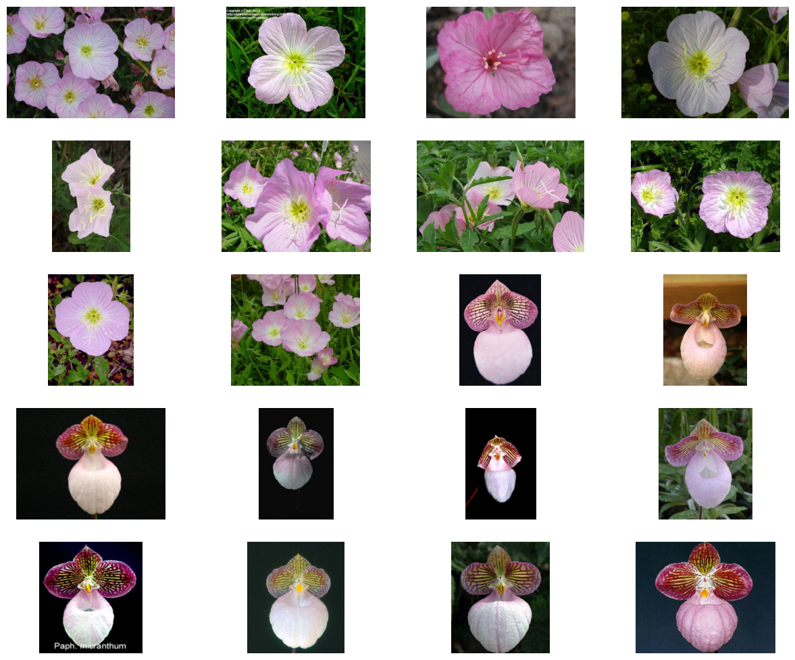
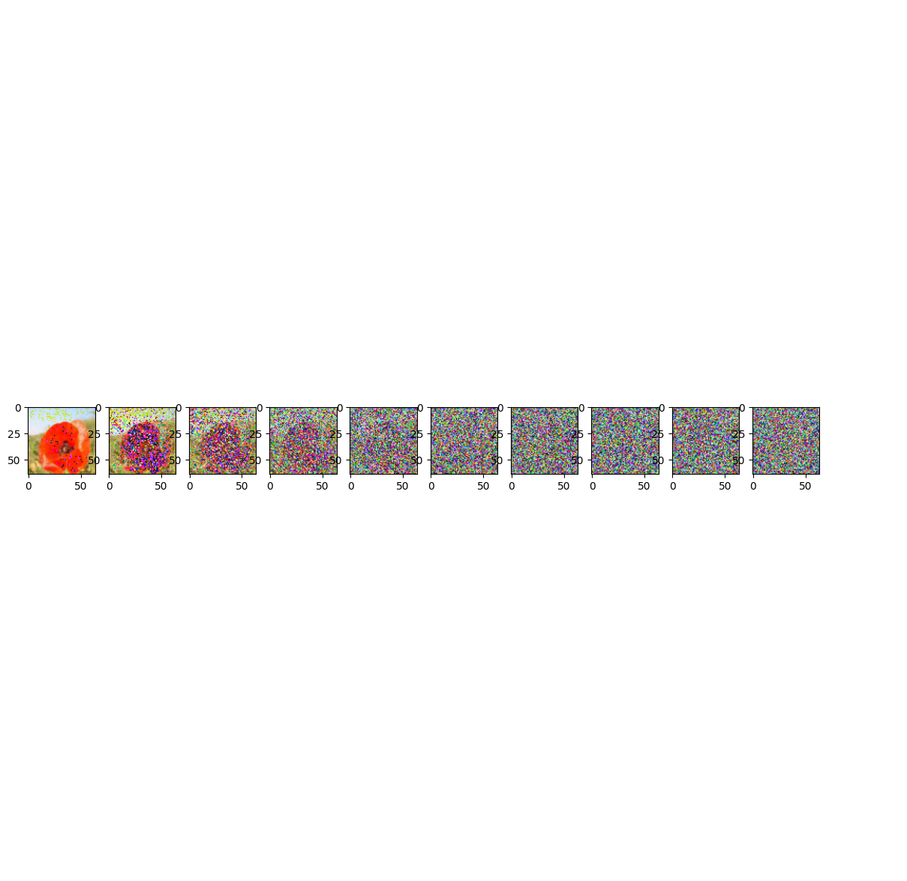
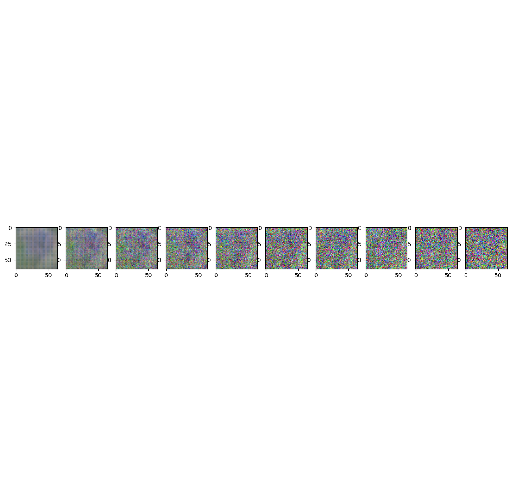
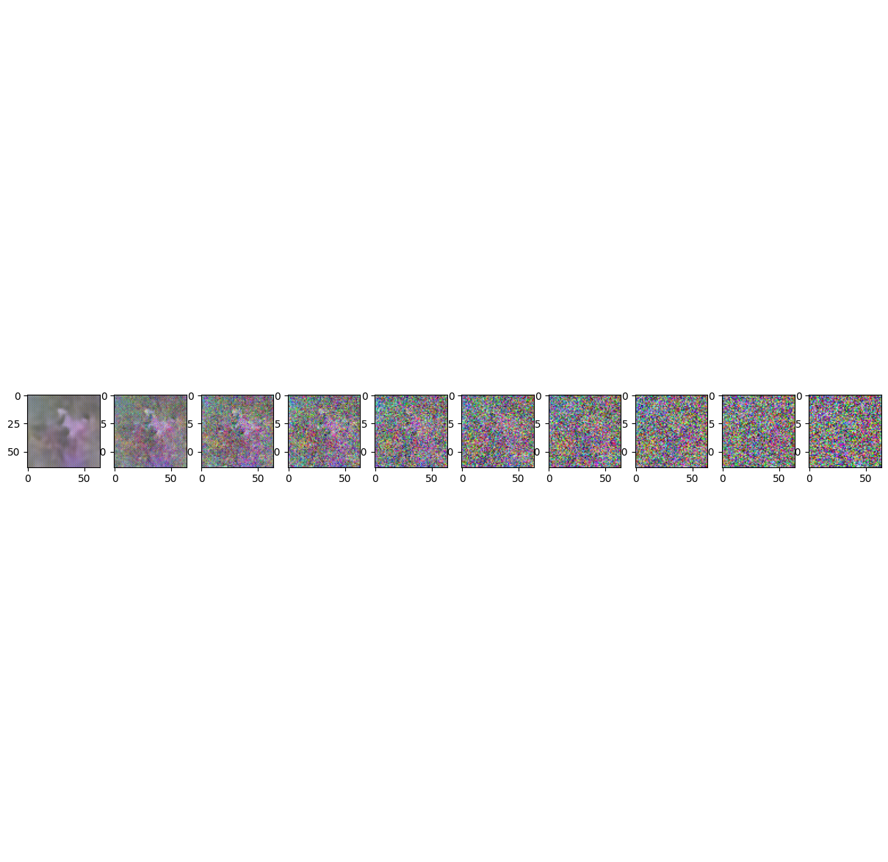
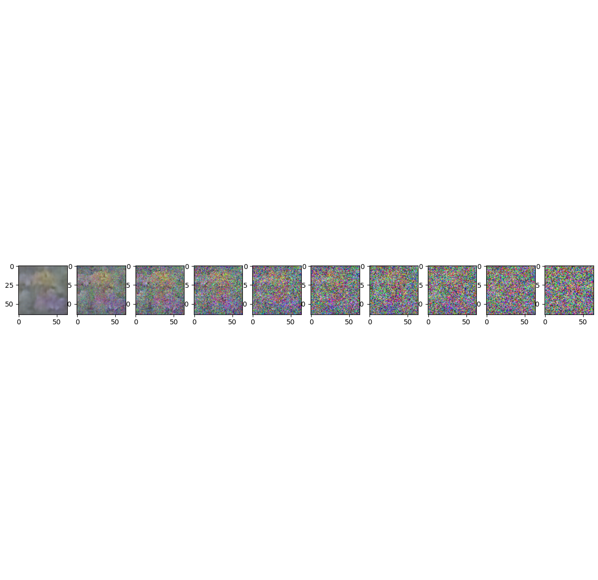

# Denoising Diffusion Probabilistic Models (DDPM)

This repository presents a from-scratch implementation and explanation of
**Denoising Diffusion Probabilistic Models (DDPM)**, as introduced in the paper
*Denoising Diffusion Probabilistic Models* by Ho et al. (2020).

The primary goal of this project is to understand the **forward diffusion
process**, its mathematical formulation, and its effect on image distributions,
using visualizations and controlled experiments.

---

## Diffusion Model Overview

Diffusion models are a class of generative models that learn to generate data by
reversing a gradual noising process. They consist of two conceptual stages:

1. **Forward diffusion process**: gradually adds noise to data over multiple
   timesteps, transforming the data distribution into a simple Gaussian.
2. **Reverse diffusion process**: learns to remove noise step by step in order
   to generate new samples.

This repository focuses on the **forward diffusion process**, which defines the
training objective and probabilistic structure of DDPMs.

---

## Dataset

The experiments use the **Oxford Flowers 102** dataset. Images are resized to
64×64 and normalized to the range [-1, 1] to match the assumptions of the
diffusion formulation.

---

## Dataset Preview

The figure below shows example images from the dataset after preprocessing.

  

---

## Forward Diffusion Process

The forward diffusion process is defined as a Markov chain that gradually adds
Gaussian noise to the data:

q(x_t | x_{t-1}) = N( √(1 − β_t) · x_{t−1}, β_t I )

where β_t is a small variance scheduled over timesteps.

By composing these transitions, the distribution of a noisy sample at timestep t
can be written in closed form as:

x_t = √(ᾱ_t) · x_0 + √(1 − ᾱ_t) · ε ,   ε ~ N(0, I)

where:
- α_t = 1 − β_t
- ᾱ_t = ∏_{s=1}^{t} α_s

This closed-form expression allows direct sampling of x_t from the original data
x_0 without iterating through all intermediate steps.

---

## Forward Diffusion Visualization

The visualization below illustrates how an image is progressively corrupted by
Gaussian noise as the timestep \(t\) increases. As \(t\) approaches the final
timestep, the image distribution becomes nearly indistinguishable from pure
Gaussian noise.

  

---

## Generated Samples Across Training

The images below show samples generated at different stages of training of the
reverse diffusion model. Early samples are dominated by noise, while later
samples exhibit increasingly coherent structure as the model learns to invert
the diffusion process.

  
  
  

  
  

---

## Interpretation

The forward diffusion process provides a smooth and well-behaved path from a
complex data distribution to a simple Gaussian distribution. This property
enables stable training of the reverse process, which learns to estimate and
remove noise at each timestep.

Unlike GANs, diffusion models avoid adversarial training and instead rely on
maximum likelihood estimation through variational bounds.

---

## Reference

Ho, J., Jain, A., & Abbeel, P. (2020).  
Denoising Diffusion Probabilistic Models.  
https://arxiv.org/abs/2006.11239
